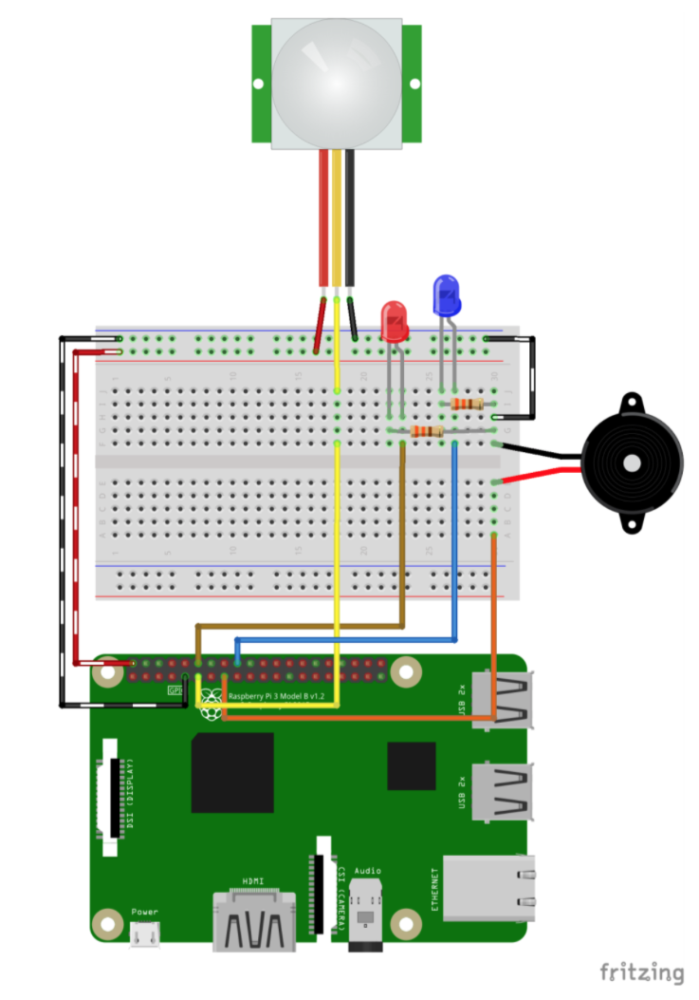

TP3
===
_infos pratiques_ : tous les raspberry ont pour login `pi` et pour mot de passe `raspberry`

1ère partie : Capteur de mouvement
---------------------------------- 

. Réalisez ce montage : 


_Lorsque le capteur détecte un mouvement, il envoie un signal sur son fil jaune. Nous allons donc configurer notre raspberry pour recevoir ce signal sur un de ses GPIOs_  
. Rendez-vous dans un dossier de travail (par exemple appelé `mouvement`)
. dans ce dossier installez l'utilitaire node `onoff` :  

```
$ npm install onoff --save
```  

. puis créez le fichier `mouvement.js` : 


```js
//Initialisation de l'utilitaire Onoff pour gérer
//les GPIOs du raspberry
const Gpio = require('onoff').Gpio;
//Initialisation de notre GPIO 17 pour recevoir un signal
//Contrairement à nos LEDs avec lesquelles on envoyait un signal
var sensor = new Gpio(17, 'in', 'both');

//Fonction pour quitter le script
function exit() {
	sensor.unexport();
	process.exit();
}

//Ici on "surveille" le GPIOs 17 (correspondant au capteur)
//Dès qu'il y a du mouvement cette partie du code sera exécuté.
sensor.watch(function (err, value) {
	if(err) exit();
	//Si le capteur détecte du mouvement 
	//On affiche 'Mouvement détecté'
	if(value == 1) {
		console.log('Mouvement détecté !');
	} else {
		console.log('fin du mouvement');
	}
});
```

. lancez le scriptop

```
$ node mouvement.js
```

. Une fois que tout fonctionne correctement, modifiez le script pour allumer/éteindre une LED lorsqu'il y a du mouvement. (si vous avez le temps, ajoutez le buzzer pour qu'il sonne pendant 500 ms dès qu'il y a du mouvement également.)


2ème partie : Websockets 
------------------------

Ici c'est le capteur qui nous fait part d'un événement. Or avec nos page web statique nous n'avons pas de moyen de réagir à ces événement. Jusque là, nous récupérions une page web et l'interaction avec le serveur était terminée. Par exemple, nous nous fallait rafraichir la page web pour mettre à jour la température. Ce qui n'est pas pratique dans notre détection de mouvement.  
Nous allons donc utiliser des **Websockets**.  
Une websocket est un canal de communication entre un serveur et un client (le navigateur). Les données peuvent transiter dans les deux sens. Pour notre utilisation, nous ferons en sorte que le serveur notifie le client dès qu'il détecte un mouvement.

. Sur Github.com, forkez `https://github.com/Aymarick/dc-pooc-ws` sur votre compte perso, et clonez-le sur le raspberry.

. Dans le dossier `dc-pooc-ws` exécutez la commande :   

```
$ npm install 
```
. modifiez le fichier `public/script.js` pour indiquer l'adresse IP ou le nom de votre raspberry.

. et lancez le serveur : 

```
$ node server.js
```
Allez sur le navigateur pour constater la communication entre le serveur et votre navigateur.


3ème partie : Websockets & Mouvements 
-------------------------------------

. Modifiez le serveur avec les websockets récupéré à l'exercice précédent pour que le serveur envoie un message au client lorsqu'il y a du mouvement.

. Ajoutez le capteur de température pour également donner la température en temps réel.